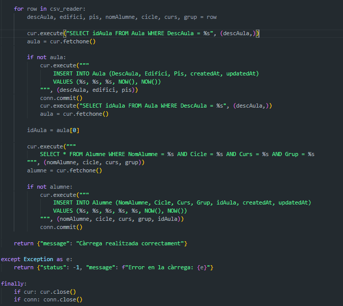

# Actitat 1:
Establim els middlewares:

Adaptam l'ALumneModel a la consulta actual, que involucra a DescAula i lleva la id De aula i alumne.

Aixi queda el js:

Resultat Final:

# Activitat 2:
Aquest es la modificacio principal, hi agregam les opcions ordeby,contain,skip i limit.

Exemples de execucio: 

Resposta:

Tots els camps son opcionals.
en cas de que no existesqui el nom:

# Activitat 3
Cridam alumnesCSV

Ho separam per ,:

Llevam la primera linea ques es comentari:

Codi:

