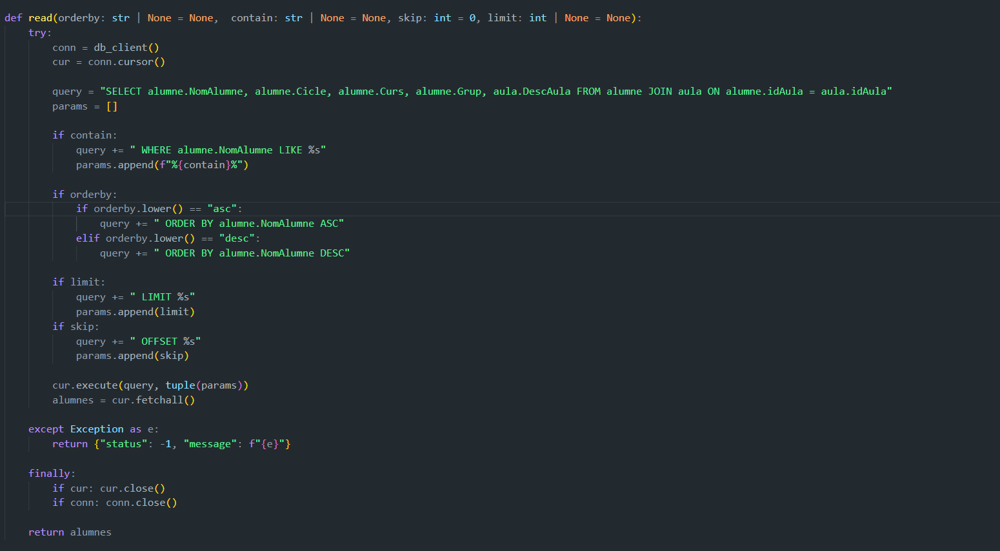
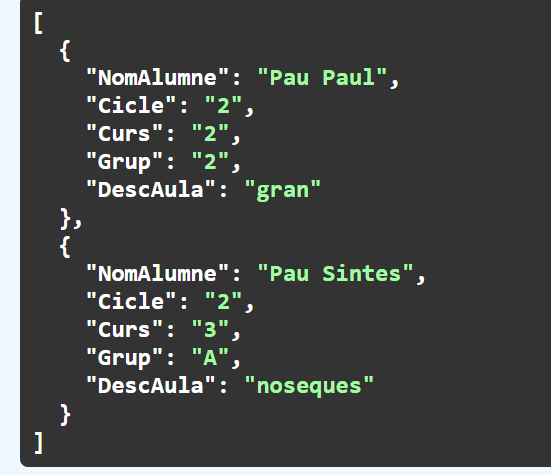
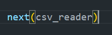

# Activitat 1

## Establiment de Middlewares

En aquesta activitat, hem configurat els middlewares necessaris per a la nostra aplicació.

## Adaptació de l'AlumneModel

Hem adaptat l'`AlumneModel` a la consulta actual, que ara inclou el camp `DescAula` i elimina les identificacions (`id`) de l'aula i de l'alumne.

## Codi JavaScript

A continuació, presentem la versió actualitzada del codi JavaScript:

## Resultat Final

El resultat final de la implementació es mostra a continuació:

---

# Activitat 2

## Modificació Principal

Aquesta activitat inclou una modificació significativa en la funcionalitat, on hem afegit les opcions `orderby`, `contain`, `skip` i `limit`.

## Exemples d'Execució

Aquí tenim alguns exemples d'execució de les noves funcionalitats:

## Resposta

Les respostes que retornem són les següents:

**Nota:** Tots els camps són opcionals. Si el nom no existeix, el sistema ho gestionarà adequadament:

---

# Activitat 3

## Crida a alumnesCSV

Hem implementat la funcionalitat `alumnesCSV`, que ens permet gestionar la importació de dades des d'un fitxer CSV.

## Separació de Dades

Les dades del fitxer CSV es separen per comes (`,`):

## Eliminació de la Primera Línia

Eliminem la primera línia del CSV, que és un comentari:

## Codi

El codi per a la gestió de la importació es mostra a continuació:

## Afegint el CSV

Finalment, afegim les dades del CSV a la base de dades:

## Resultat Final

La implementació acaba amb els següents resultats:

